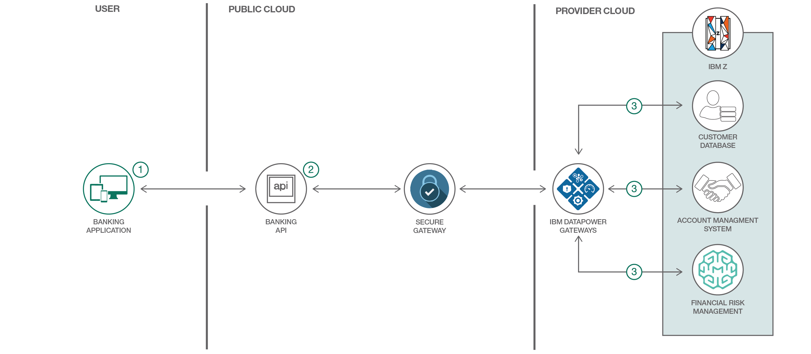
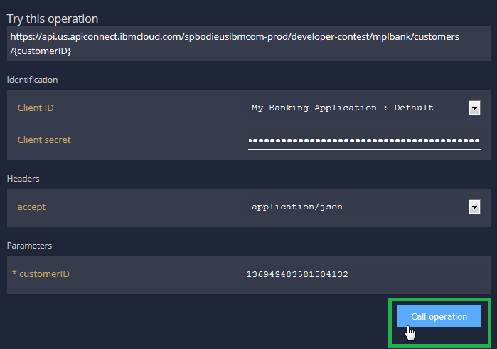
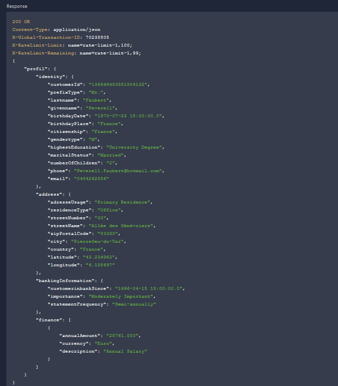
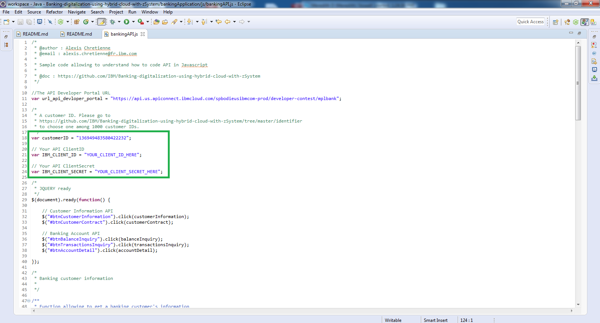
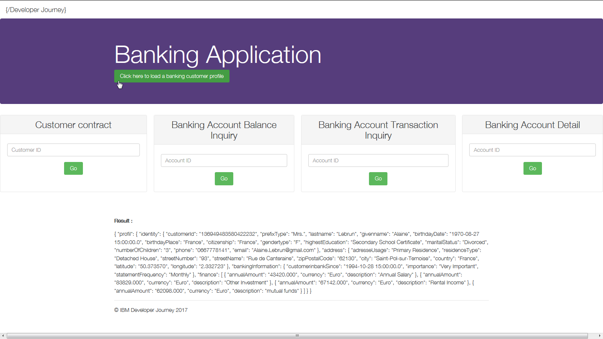
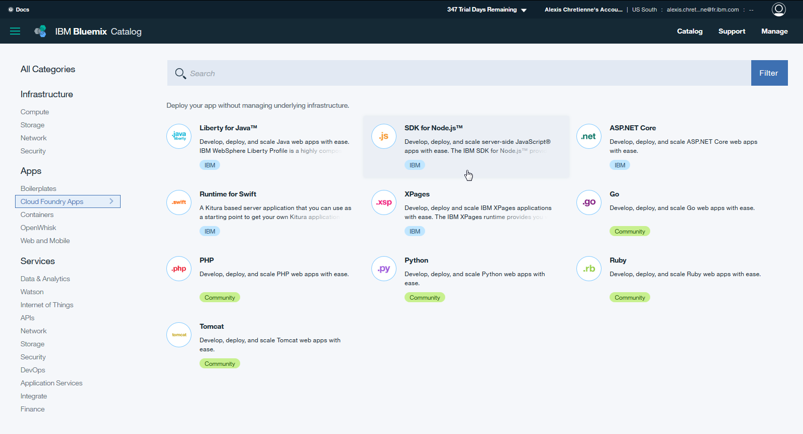
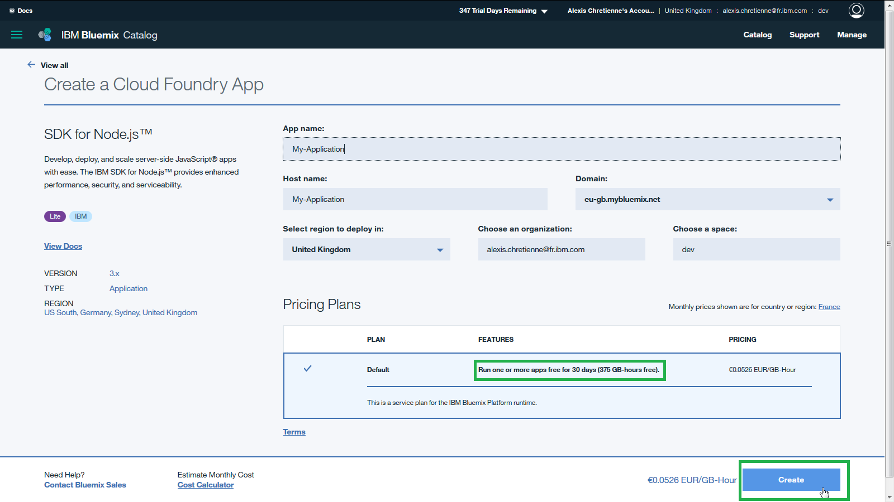
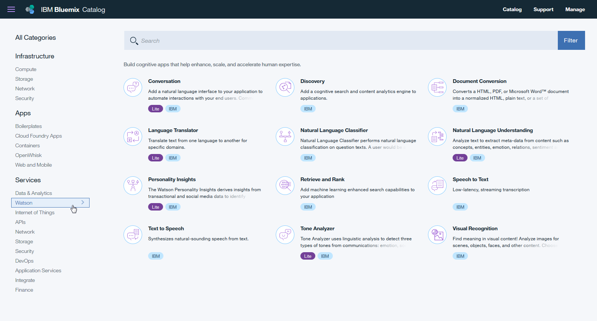
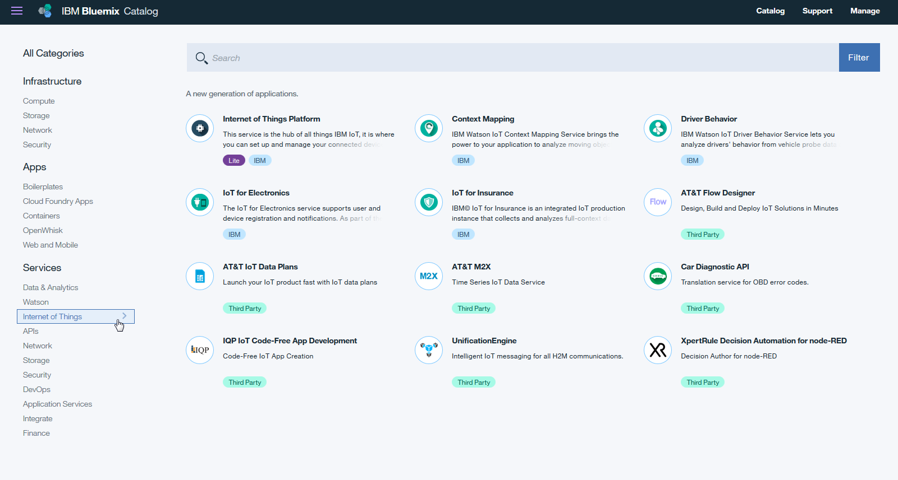

# Banking Digitalization using Hybrid Cloud with z Systems

The following documentation will introduce the available Banking APIs published on IBM Bluemix with logical business programs running on the IBM Z Mainframe through a simulated retail bank called MPLbank.

# MPLbank

## Architecture

This journey accesses a fictitious retail banking system called MPLbank. Similar to real retail bank systems, MPLbank is contains an Account Management System, a Payment Hub (not shown in the schema), a Customer Management System & a Financial Risk Management System. On top of these components, an API layer hosted in IBM Bluemix has been set up to deliver Banking APIs, reachable from many kind of applications.

Banking APIs exposed include:
* **/customers/** API path calls IBM Master Data Management services in MPLbank.
* **/accounts/** API path calls the Account Management System services in MPLbank.
* **/customers/loan/** API path calls the Financial Risk Management System service in MPLbank.

The customer and loan approval Mainframe sub-systems expose services through built-in REST/JSON Interfaces. In front of the Account Management sub-system, IBM z/OS Connect EE has been setup to create REST/JSON Interfaces from COBOL programs running in CICS. As a result, these 3 sub-systems are flexible and reachable using REST/JSON APIs. These sub-systems act as micro-services by delivering REST/JSON interfaces and IBM API Connect acts as API layer to manage a unique and final set of banking REST/JSON APIs. The resulting hybrid architecture approach enables the best of both worlds and build a fast and secure API Economy.

More information about data in [MPLBank Readme].

## Included Components

The journey is accomplished by using an Hybrid [IBM Bluemix] / [IBM Z Mainframe] architecture.

* [IBM Db2]
* [IBM CICS Transaction Server]
* [IBM z/OS Connect Enterprise Edition]
* [IBM API Connect]

More information about Technologies in [MPLBank Readme].

# Steps

### Part A: Discover and test the Banking APIs

1.	[Start with IBM Developer API Portal](#1-start-with-ibm-developer-api-portal)
2.	[Subscribe to the Banking APIs](#2-subscribe-to-the-banking-apis)
3.	[Work with the Banking APIs](#3-work-with-the-banking-apis)

### Part B: Make you own banking application

1.	[Download and review the Banking application code](#1-download-and-review-the-banking-application-code)
2.	[Run the Banking application](#2-run-the-banking-application)

### Part C: Extend the Banking application

1. 	[Start with Node.js on Bluemix](#1-start-with-node-js-on-bluemix)
2.	[Make a Cognitive application using Watson Services](#2-make-a-cognitive-application-using-watson-services)

---

# Part A: Discover and test the Banking APIs

## 1. Start with IBM Developer API Portal 
1.	Sign up for an [IBM ID] if you don't have one already.

2.	Go to [IBM Developer Portal].

3. Create an account if you have not done do already.
	
   * Click **Create an Account**.
   * Provide all required information. Be sure to use your IBM ID (email) for this account.
   * Click **Submit**.

  
   An account activation email will be sent to your registred IBM ID email. Click on the link in this email to activate your account before.

4. Login to your account.

5. Create a new application (work space for this project).
	
	* Click **Apps** from the menu.
	* Click **Create new App**.
	* Fill in all required fields.
	* Click **Submit**.
	
	Make a note of the *client ID* and *client Secret*. You will need them to access the API later.
	

## 2. Subscribe to the Banking APIs 

1.	Before working with banking APIs, you need to subscribe first. Display the list of available API products.
	
	* Click **API Products** from the top menu.
	* Click **Banking Product** in the list.

2. 	Subscribe for Banking APIs.
	
	* Click **Subscribe** from the Default Plan.
	
	
	* Select the App that you have just created before.
	* Click **Subscribe**.
	
## 3. Work with the Banking APIs
	
1.	Go to the Banking API page.
	
	* Click **Banking APIs**.
	
	This Page has 3 sections:
   	* The left panel is the navigation panel that lists all the available operations and their definitions. 
    * The middle panel displays detail information for the item you have selected. 
    * The right panel contains sample code in various programming language.
    
2.	Discover the API **GET /customers/{customerID}** by reading its documentation.
	
	* Click **GET /customers/{customerID}**.
    
    This operation gives personal data relative to a banking customer. All available customers ID are in the */identifier/customerIDs.txt* file in this Github repository.
    
3.	Generate code for the API **GET /customers/{customerID}** following the right panel of this operation.
	
	* Click a programming language that you want work with.
    
   	Code example in the selected programming language and an example output of a successful response are displayed. You can copy the code and use it in your own application.
  
4. 	Test the API **GET /customers/{customerID}** depending on your programming language.
   	
   	
	* Scroll down to **Try this operation** section.
	
	> IMPORTANT: All available customers ID are in the */identifier/customerIDs.txt* file in this Github repository. Do not forget to fill the *x-ibm-client-id* and *x-ibm-client-secret* with yours.

   	* Click **Call Operation**.
 	
 	You should see output returned at the bottom of the page.  	
 	
 	
 	

5.	Replay this scenario in order to test all APIs in this banking product. All input parameters of the other APIs are found from the JSON output of the **GET /customers/{customerID}**.

---

:thumbsup: Congratulations! You have successfully discovered and tested the Banking APIs.

---

# Part B: Make you own banking application

A quick banking application has been developed in order to help you to start coding. This web application (HTML/CSS/javascript) uses banking APIs introduced before. 

## 1. Download and review the Banking application code

1.	Download and import the project *bankingApplication* located in this Github repository into you preferred IDE like Eclipse.

2.	Review the *index.html* file in order to understand how the program works.

3.	Review the *bankingAPI.js* file in order to understand how the program works.
	
	* Change the customer ID if needed. It has been hardcoded for this sample code. 
	> NOTE: You can change the customer identifier though the *identifier* folder in this Github repository. 1000 customers has been generated, meaning it represents 1000 different banking customers.
	* Replace replace **IBM_CLIENT_ID** & **IBM_CLIENT_SECRET** variables by yours.
	
## 2. Run the Banking application
	
1.	Open the *index.html* in your favorite web browser. The application will automatically run.
	
2.	Click on the button **Click here to load a banking customer profile**. 
	
	
	This click will call the published API **GET /customer/{customerID}**. 
	
3. 	Understand the output JSON response from this API call.

4.	Call each other services representing each published API.

---

:thumbsup: Congratulations! You have successfully developed your first banking application.

---

# Part C: Extend the Banking application

The purpose of this sample application is to understand how to code and use APIs. If you want more about APIs, Hybrid Architecture and Bluemix, Please find ideas below

## 1. Start with Node.js on Bluemix

1.	[Sign up or log in to IBM Bluemix]
	
	> NOTE: Use IBM Bluemix to create, test and deploy a quick application. Choose among JAVA Liberty Profile, Node Js servers, Ruby, Python, etc... This platform also provides DevOps tools for a continuous delivery (Git, automatic deployment) and a lot of innovative features & services.

2.	Go to the catalog and select **SDK for Node.js**.
	

3.	Configure your Node.js project for free (30 days).
	
	* Give an App name.
	* Select a domain.
	* Select a region to deploy the project.
	* Click **Create**.

4. 	Wait for the Node.js Runtime creation.

5. 	Once created, explore this panel to be familiar with it.
	
	* Click **Visit App URL**. The default Node.js Project (Hello World) has been provided.
	* Explore each menu on the left panel to understand the Runtime, connections, logs, etc.
 
6.	Follow the **Getting Started** to learn how to edit, pull and push code from your IDE to your Node.js Runtime in Bluemix.

7.	Code the financial Risk Management API in your Node.js Application using the API developer Portal Documentation.

## 2. Make a Cognitive application using Watson Services

1.	Integrate [IBM Watson Services] (APIs) from the Bluemix catalog. 
	
	* Choose one of them.

2.	Create the service
	
	* Connect to your existing Node.js Project.
	* Click **Create**.
	
3. 	Wait for the chosen Watson Service creation. It will be prompted for restaging your Node.js Application.

4.	Explore the chosen Watson service in your Node.js Application
	
	* Click **Connections**.
	* Click **Docs**. You will learn how to use this service through APIs.
	* Click **View Credentials**. You will have your API Credentials.
	
5. Code the chosen Watson service in your Node.js Application using the documentation and credentials.
---

:thumbsup: Congratulations! You have successfully developed your first banking Cognitive application in Bluemix.

---

* Bring your own IOT devices ([RASPBERRY PI], [ARDUINO], etc..) to make an innovative project coupled with [IBM Internet of Things Services].

[IBM Bluemix]: https://www.ibm.com/us-en/marketplace/cloud-platform
[IBM Z Mainframe]: https://www-03.ibm.com/systems/z/

[IBM Digital Transformation Model]: https://developer.ibm.com/mainframe/ibm-digital-transformation/

[IBM CICS Transaction Server]: https://www-01.ibm.com/software/data/enterprise-application-servers/cics/

[IBM z/OS Connect Enterprise Edition]: https://www.ibm.com/ms-en/marketplace/connect-enterprise-edition

[IBM Db2]: https://www.ibm.com/analytics/us/en/technology/db2/?lnk=STW_US_SHP_A4_TL&lnk2=learn_DB2

[IBM API Connect]: http://www-03.ibm.com/software/products/en/api-connect

[IBM ID]: https://www.ibm.com/account/us-en/signup/register.html
[IBM Developer Portal]: https://developer-contest-spbodieusibmcom-prod.developer.us.apiconnect.ibmcloud.com/

[Sign up or log in to IBM Bluemix]: https://console.bluemix.net/registration/?

[Financial Risk Management System]:https://github.com/IBM/Financial-risk-management-using-machine-learning-on-zSystems

[Financial Risk Management API]:https://github.com/IBM/Financial-risk-management-using-machine-learning-on-zSystems

[IBM Watson Services]: https://www.ibm.com/cloud-computing/bluemix/watson
[IBM Internet of Things Services]: https://www.ibm.com/cloud-computing/bluemix/internet-of-things

[MPLBank Readme]: https://github.com/IBM/Banking-digitalization-using-hybrid-cloud-with-zSystem/blob/master/MPLBank%20Readme.md

[RASPBERRY PI]:https://www.raspberrypi.org/
[ARDUINO]:https://www.arduino.cc/
