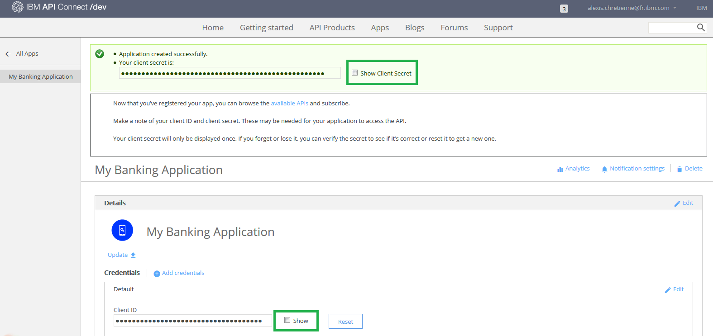
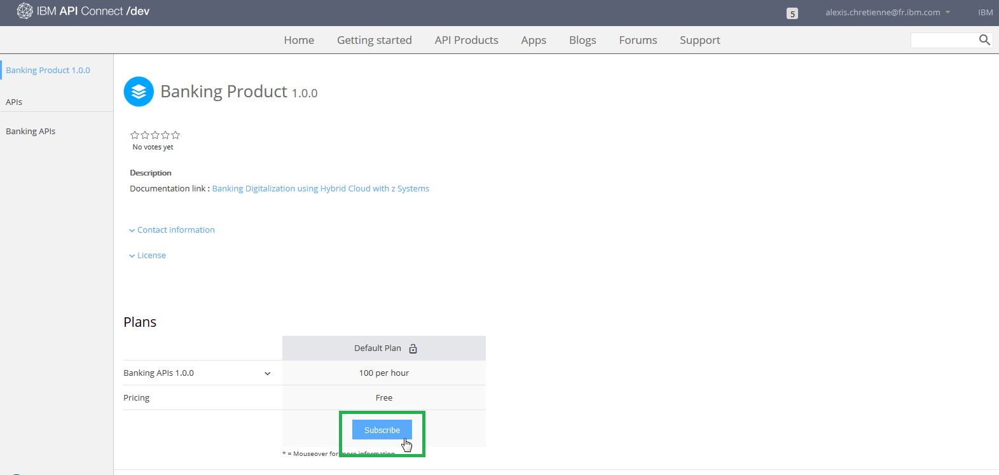
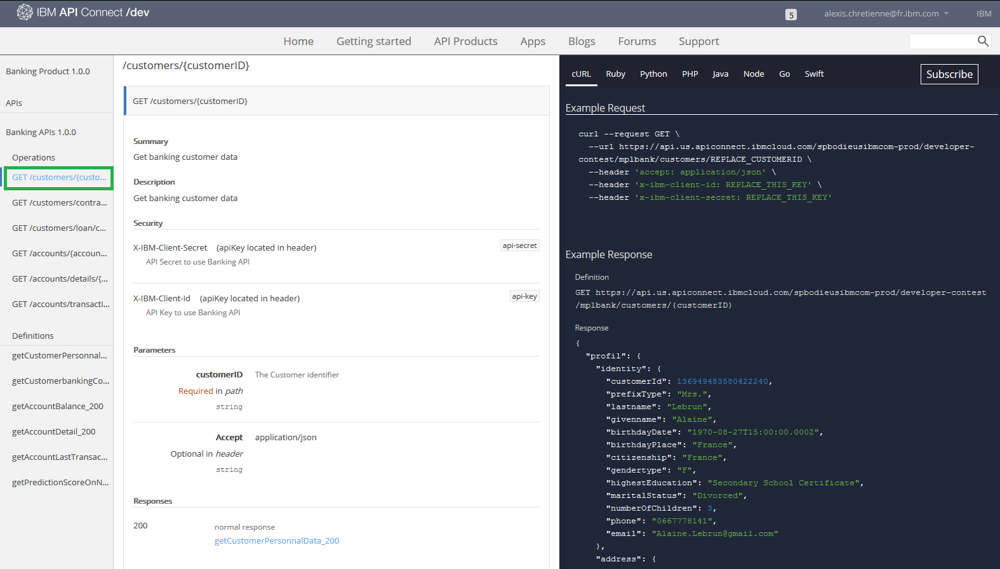
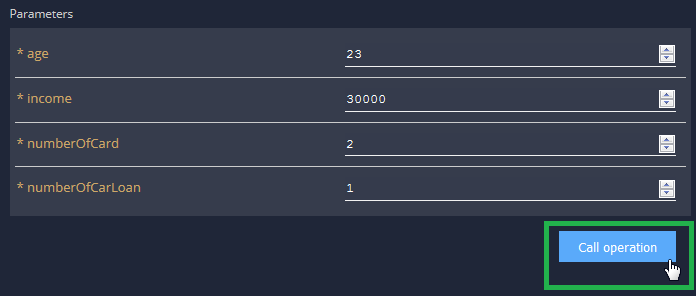
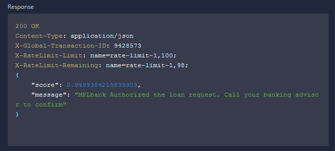
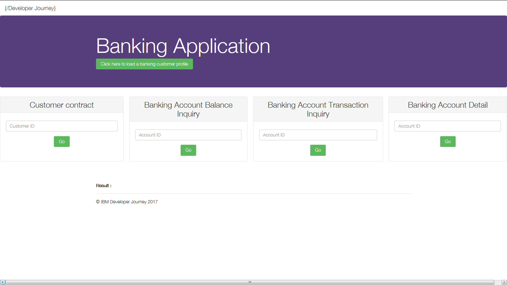

# Banking Digitalization using Hybrid Cloud with z Systems

The following documentation will introduce the available Banking APIs published on [IBM Bluemix] with logical business programs running on the [IBM Z Mainframe] through a simulated retail bank called MPLbank.

# MPLbank

## Architecture

This journey accesses a fictitious retail banking system called MPLbank. Similar to real retail bank systems, MPLbank is contains an Account Management System, a Payment Hub (not shown in the schema), a Customer Management System & a Financial Risk Management System based on Machine Learning. On top of these components, an API layer hosted in IBM Bluemix has been set up to deliver Banking APIs, reachable from many simulated banking channels.

Banking APIs exposed for this Journey include:
* **/customers/** API path calls IBM Master Data Management services in MPLbank (Part II).
* **/accounts/** API path calls the Account Management System services in MPLbank (Part II).
* **/customers/loan/** API path calls the Financial Risk Management System service in MPLbank (Part III).

The customer and loan approval Mainframe sub-systems expose services through built-in REST/JSON Interfaces. In front of the account sub-system, IBM z/OS Connect EE creates REST/JSON Interfaces from COBOL programs running in CICS. As a result, these 3 sub-systems are flexible and reachable using REST/JSON API. These sub-systems act as micro-services by delivering REST/JSON interfaces and IBM API Connect acts as API layer to manage a unique and final set of banking REST/JSON APIs.  The resulting hybrid architecture approach enables the best of both worlds and build a fast and secure API Economy.

More information about data in [MPLBank Readme].

## Included Components

Deployed IBM Mainframe Technologies:
* [IBM Z Mainframe] ([IBM z Systems Mainframe Redbook] & [IBM z Systems Mainframe developerWorks])
* [IBM z/OS] ([IBM z/OS Knowledge Center])
* [IBM CICS Transaction Server] ([IBM CICS TS Knowledge Center] & [IBM CICS TS developerWorks])
* [IBM z/OS Connect Enterprise Edition] ([IBM z/OS Connect EE Knowledge Center] & [IBM z/OS Connect EE developerWorks])
* [IBM Db2] ([IBM Db2 Knowledge Center])
* [IBM Master Data Management] ([IBM Master Data Management Knowledge Center])
* [IBM Machine Learning for z/OS]
* ... and a real core banking system ([SOPRA Account Management]) running in IBM CICS TS!

Deployed IBM Bluemix Technologies:
* [IBM Bluemix]
* [IBM API Connect] ([IBM API Connect Knowledge Center] & [IBM API Connect developerWorks])
* [IBM Secure Gateway Service]

An [IBM DataPower Gateway] ([IBM DataPower Gateway Knowledge Center]) has been setup in front of MPLbank for security reasons. It also acts as a Secure Gateway Client and is connected to the Secure Gateway Service in Bluemix.

# Part I: Discover & test the Banking APIs

## Get Started with IBM Developer API Portal 
1.	Sign up for an [IBM ID] if you don't have one already.

2.	Go to [IBM Developer Portal].

3. Create an account if you have not done do already.
	
   * Click **Create an Account**.
   * Provide all required information. Be sure to use your IBM ID (email) for this account.
   * Click **Submit**.

  
   An account activation email will be sent to your registred IBM ID email. Click on the link in this email to activate your account before.

4. Login to your account.

5. Create a new application (work space for this project).
	
	* Click **Apps** from the menu.
	* Click **Create new App**.
	* Fill in all required fields.
	* Click **Submit**.
	
	Make a note of the *client ID* and *client Secret*. You will need them to access the API later.
	

## Work with Banking APIs 

1.	Before working with banking APIs, you need to subscribe first. Display the list of available API products.
	
	* Click **API Products** from the top menu.
	* Click **Banking Product** in the list.

2. 	Subscribe for Banking APIs.
	
	* Click **Subscribe** from the Default Plan.
	
	
	* Select the App that you have just created before.
	* Click **Subscribe**.
	
3. :thumbsup: **CONGRATULATIONS**. You just succeeded to subscribe to an API from the developer portal! Ready to **discover** & **test** the banking APIs?

4.	Go to the Banking API page.
	
	* Click **Banking APIs**.
	
	This Page has 3 sections:
   	* The left panel is the navigation panel that lists all the available operations and their definitions. 
    * The middle panel displays detail information for the item you have selected. 
    * The right panel contains sample code in various programming language.
    
5.	Discover the API **GET /customers/{customerID}** by reading its documentation.
	
	* Click **GET /customers/{customerID}**.
    
    This operation gives personal data relative to a banking customer. All available customers ID are in the */identifier/customerIDs.txt* file in this Github repository.
    
6.	Generate code for the API **GET /customers/{customerID}** following the right panel of this operation.
	
	* Click a programming language that you want work with.
    
   	Code example in the selected programming language and an example output of a successful response are displayed. You can copy the code and use it in your own application.
  
7. 	Test the API **GET /customers/{customerID}** depending on your programming language.
   	
   	
	* Scroll down to **Try this operation** section.
	
	> IMPORTANT: All available customers ID are in the */identifier/customerIDs.txt* file in this Github repository. Do not forget to fill the *x-ibm-client-id* and *x-ibm-client-secret* with yours.

   	* Click **Call Operation**.
 	
 	You should see output returned at the bottom of the page.  	
 	
 	
 	

8.	Replay this scenario in order to test all APIs in this banking product. All input parameters of the other APIs are found from the JSON output of the **GET /customers/{customerID}**.

---

:thumbsup: Congratulations! You have successfully discovered and tested the Banking APIs.

---

# Part II: Discover & test the Financial Risk Management API

1.	Read the documentation about the implemented [Financial Risk Management System].

2.	Discover the API  **Get /customers/loan/calculateScore**. 
	
	* Click **GET /customers/{customerID}**.
	
3.	Test the API **Get /customers/loan/calculateScore** depending on Input parameters:
	
	| Parameters            | Value   | example |
	|-----------------------|---------|---------|
	| Age                   | Integer | 23      |
	| Income                | Integer | 30000   |
	| Number of credit Card | Integer | 2       |
	| Number of car loan    | Integer | 1       |
	
	
	* Scroll down to **Try this operation** section.
	* Fill with Input values.
	* Click **Call Operation**.
	
	You should see output returned at the bottom of the page. 	
	
	
	
 	A score and a message is returned.

4.	Change Input parameters and re-test.

---

:thumbsup: Congratulations! You have successfully discovered and tested the Financial Risk Management API.

---

# Part III: Make you own banking application

A quick banking application has been developed in order to help you to start coding. This web application (HTML/CSS/javascript) uses banking APIs introduced before. 

1.	Download and import the project *bankingApplication* located in this Github repository into you preferred IDE like Eclipse.

2.	Review the *index.html* file in order to understand how the program works.

3.	Review the *bankingAPI.js* file in order to understand how the program works.
	
	* Change the customer ID if needed. It has been harcoded for this sample. you can change it though the *identifier* folder in this Github repository. 1000 customers has been generated, meaning it represents 1000 different banking customers.
	* Replace replace **IBM_CLIENT_ID** & **IBM_CLIENT_SECRET** variables by yours.
	
4.	Open the *index.html* in your favorite web browser. The application will automatically run.
	

	Click on the button **Click here to load a banking customer profile**. This click will call the published API **GET /customer/{customerID}**. A result is displayed in the bottom of the page. Actually, it represents the expected JSON structure returned by the API. Then, explore this banking application through the code and call each services representing each published API.

---

:thumbsup: Congratulations! You have successfully developed your first application.

---

# Suggestions for extending this application

The purpose of this sample application is to understand how to code and use APIs. If you want more about APIs, Hybrid Architecture and Bluemix, Please find ideas: 

* Convert this sample project to a Node JS project on IBM Bluemix. [Sign up or log in to IBM Bluemix].
	> NOTE: Use IBM Bluemix to create, test and deploy a quick application. Choose among JAVA Liberty Profile, Node Js servers, Ruby, Python, etc... This platform also provides DevOps tools for a continuous delivery (Git, automatic deployment).

* Integrate [IBM Watson Services] (APIs) to build a banking cognitive application.

* Bring your own IOT devices ([RASPBERRY PI], [ARDUINO], etc..) to make an innovative project coupled with [IBM Internet of Things Services].

[IBM Digital Transformation Model]: https://developer.ibm.com/mainframe/ibm-digital-transformation/

[IBM Bluemix]: https://www.ibm.com/us-en/marketplace/cloud-platform
[IBM Z Mainframe]: https://www-03.ibm.com/systems/z/

[IBM z Systems Mainframe Redbook]: https://www.redbooks.ibm.com/redbooks.nsf/pages/z13?Open
[IBM z Systems Mainframe developerWorks]: https://developer.ibm.com/mainframe/

[IBM z/OS]: https://www-03.ibm.com/systems/z/os/zos/
[IBM z/OS Knowledge Center]: https://www.ibm.com/support/knowledgecenter/en/SSLTBW

[IBM CICS Transaction Server]: https://www-01.ibm.com/software/data/enterprise-application-servers/cics/
[IBM CICS TS Knowledge Center]: https://www.ibm.com/support/knowledgecenter/en/SSGMGV
[IBM CICS TS developerWorks]: https://developer.ibm.com/cics/

[IBM z/OS Connect Enterprise Edition]: https://www.ibm.com/ms-en/marketplace/connect-enterprise-edition
[IBM z/OS Connect EE Knowledge Center]: https://www.ibm.com/support/knowledgecenter/en/SS4SVW
[IBM z/OS Connect EE developerWorks]: https://developer.ibm.com/mainframe/products/zosconnect/

[IBM Db2]: https://www.ibm.com/analytics/us/en/technology/db2/?lnk=STW_US_SHP_A4_TL&lnk2=learn_DB2
[IBM Db2 Knowledge Center]: https://www.ibm.com/support/knowledgecenter/en/SSEPEK/db2z_prodhome.html

[IBM Master Data Management]: https://www.ibm.com/analytics/us/en/technology/master-data-management/
[IBM Master Data Management Knowledge Center]: https://www.ibm.com/support/knowledgecenter/en/SSWSR9

[IBM Machine Learning for z/OS]: https://www.ibm.com/ms-en/marketplace/machine-learning-for-zos
[IBM Machine Learning for z/OS Knowledge Center]: https://www.ibm.com/support/knowledgecenter/en/SS9PF4

[SOPRA Account Management]: https://www.soprabanking.com/our-offer/solutions/account-management-9

[IBM API Connect]: http://www-03.ibm.com/software/products/en/api-connect
[IBM API Connect Knowledge Center]: https://www.ibm.com/support/knowledgecenter/en/SSMNED 
[IBM API Connect developerWorks]: https://developer.ibm.com/apiconnect/

[IBM Secure Gateway Service]: https://console.bluemix.net/docs/services/SecureGateway/secure_gateway.html

[IBM DataPower Gateway]: http://www-03.ibm.com/software/products/en/datapower-gateway
[IBM DataPower Gateway Knowledge Center]: https://www.ibm.com/support/knowledgecenter/en/SS9H2Y 

[IBM SPSS]: https://www.ibm.com/analytics/us/en/technology/spss/

[IBM ID]: https://www.ibm.com/account/us-en/signup/register.html
[IBM Developer Portal]: https://developer-contest-spbodieusibmcom-prod.developer.us.apiconnect.ibmcloud.com/

[Sign up or log in to IBM Bluemix]: https://console.bluemix.net/registration/?

[Financial Risk Management System]:https://github.com/IBM/Financial-risk-management-using-machine-learning-on-zSystems

[Financial Risk Management API]:https://github.com/IBM/Financial-risk-management-using-machine-learning-on-zSystems

[IBM Watson Services]: https://www.ibm.com/cloud-computing/bluemix/watson
[IBM Internet of Things Services]: https://www.ibm.com/cloud-computing/bluemix/internet-of-things

[MPLBank Readme]: https://github.com/IBM/Banking-digitalization-using-hybrid-cloud-with-zSystem/blob/master/MPLBank%20Readme.md

[RASPBERRY PI]:https://www.raspberrypi.org/
[ARDUINO]:https://www.arduino.cc/
